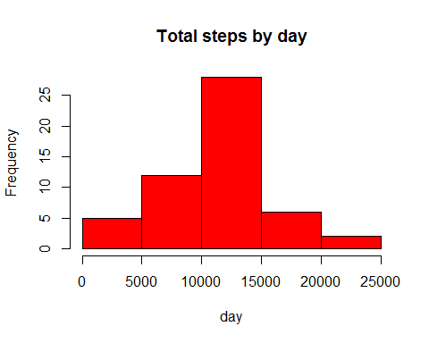
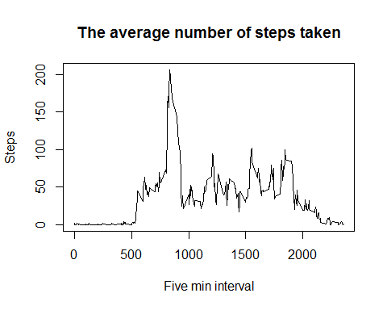
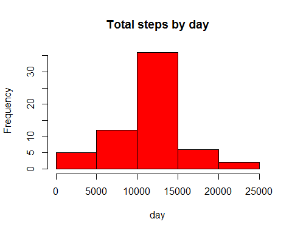

# Reproducible Research: Peer Assessment 1
César Muñoz  
Saturday, June 13, 2015  

### Loading Libraries

```r
    library(sqldf)
```

```
## Loading required package: gsubfn
## Loading required package: proto
## Loading required package: RSQLite
## Loading required package: DBI
```

```r
    library(lattice)
```

## Loading and preprocessing the data

Loading activity file and assigning data to "stepsData" dataframe

```r
    stepsData <- read.csv("activity.csv")
```
Creating the stepsDataNoNA dataset omiting NA values


```r
    stepsDataNoNA <- na.omit(stepsData)
```

## What is mean total number of steps taken per day?
For this part of the assignment the missing values had been ignored.

Group and sum data.

```r
    sumSteps <- aggregate(stepsDataNoNA[,1], list(minute=stepsDataNoNA$date), sum)
```
1. Make a histogram of the total number of steps taken each day

```r
    hist(sumSteps$x, breaks=seq(0,25000,by=5000), freq=TRUE, 
         xlab="day", main="Total steps by day", col="Red")
```

 

2. Calculate and report the mean and median total number of steps taken per day


```r
    mean(sumSteps$x)
```

```
## [1] 10766.19
```

```r
    median(sumSteps$x)
```

```
## [1] 10765
```
## What is the average daily activity pattern?

1. Make a time series plot (i.e. type = "l") of the 5-minute interval (x-axis) and the average number of steps taken, averaged across all days (y-axis)

First group and obtain the avergae steps from the dataset without NA values.

```r
    averageSteps <- aggregate(stepsDataNoNA[,1], list(interval=stepsDataNoNA$interval), mean)
```
after make the plot.

```r
    plot(averageSteps$interval, averageSteps$x, type="l",
         xlab="Five min interval", ylab="Steps", 
         main="The average number of steps taken")
```

 

2. Which 5-minute interval, on average across all the days in the dataset, contains the maximum number of steps?


```r
    max_interval <- averageSteps[which.max(averageSteps$x),]
    max_interval
```

```
##     interval        x
## 104      835 206.1698
```
The 835 interval contains the maximum number of steps.

## Imputing missing values

1.Calculate and report the total number of missing values in the dataset (i.e. the total number of rows with NAs)


```r
    NaValuesData <- sqldf('select s.* from "stepsData" as s
                          where s.steps is null
                          order by s.date, s.interval')
```

```
## Loading required package: tcltk
```

```r
    #Número de registros con NA
    print(nrow(NaValuesData))
```

```
## [1] 2304
```
2 and 3 Creating a new dataset, filling the NA Values with mean for that 5-minute interval

```r
    fillMeanValuesData <- sqldf('select s.*, a.x
                                 from "averageSteps" as a
                                join "stepsData" as s
                                on a.interval = s.interval
                                order by s.date, s.interval')

fillMeanValuesData$steps[is.na(fillMeanValuesData$steps)] <- fillMeanValuesData$x[is.na(fillMeanValuesData$steps)]
```

4. Make a histogram of the total number of steps taken each day and Calculate and report the mean and median total number of steps taken per day. 

Group and sum data into a new dataset.

```r
sumMeanValuesData <- aggregate(fillMeanValuesData[,1], list(y=fillMeanValuesData$date), sum)
```
Making the plot.

```r
    hist(sumMeanValuesData$x, breaks=seq(0,25000,by=5000), 
         freq=TRUE, xlab="day", main="Total steps by day", col="Red")
```

 

Do these values differ from the estimates from the first part of the assignment? 

R: Yes

What is the impact of imputing missing data on the estimates of the total daily number of steps?

R: The frequency counts increases.

## Are there differences in activity patterns between weekdays and weekends?

1.Create a new factor variable in the dataset with two levels -- "weekday" and "weekend" indicating whether a given date is a weekday or weekend day.


```r
    fillMeanValuesData$day <- c("weekend", "weekday", "weekday", "weekday", "weekday", 
                    "weekday", "weekend")[as.POSIXlt(fillMeanValuesData$date)$wday + 1]
```
2.Make a panel plot containing a time series plot (i.e. type = "l") of the 5-minute interval (x-axis) and the average number of steps taken, averaged across all weekday days or weekend days (y-axis). The plot should look something like the following, which was created using simulated data:


```r
    stepsByDay <- aggregate(steps ~ interval + day, data = fillMeanValuesData, mean)
    
    xyplot(steps ~ interval | day, data = stepsByDay, type="l",
           xlab="Interval", ylab="Number of steps", layout=c(1,2))
```

 


